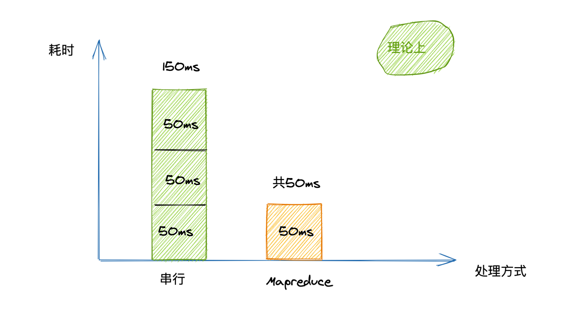
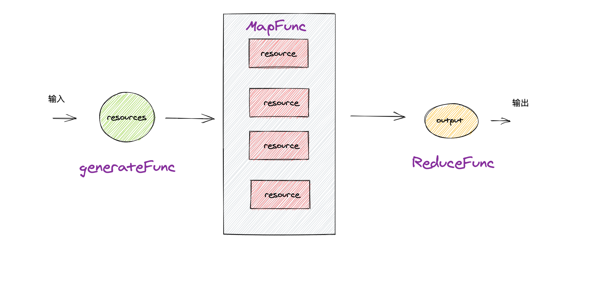

# 项目地址:

https://github.com/sado0823/go-map-reduce


# what?

```js
MapReduce是Google提出的一个软件架构，用于大规模数据集（大于1TB）的并行运算。概念“Map（映射）”和“Reduce（归纳）”，及他们的主要思想，都是从函数式编程语言借鉴的
```

有一些术语要介绍一下：

- Job。整个MapReduce计算称为Job。
- Task。每一次MapReduce调用称为Task。
- Resource。生成的需要处理的数据
- Map。数据处理函数, 输入中间数据到Reduce
- Reduce。聚合map中间数据, 输出最终结果

所以，对于一个完整的MapReduce Job，它由一些Map Task和一些Reduce Task组成。所以这是一个单词计数器的例子，它解释了MapReduce的基本工作方式。

# why?

在微服务的架构下, 可能某一份数据需要call几个service聚合而成, 如果用`串行`的方式去做, 接口的耗时肯定会高, 参考`Ma pReduce`的思想, 我们可以使用并行的方式去做, 也就是说, 接口的最高耗时肯定是延迟最高的`service call` + `自身处理时间`




在`go`中, 实现这种思想的方式(或者说`并发控制`), 有`waitGroup`和`errorGroup`可以使用:

`waitGroup`: 需要手动写 `add`和`wait`, 对于新手不友善

`errorGroup`: 官方包有`context`问题和`panic`没有`recover`的问题, 一般会进行二次封装使用

# how?

## 基本思想

今天的`MapReduce`的方式主要采用以下方式实现:

1) 一个原始数据生成方法 `GenarateFunc`

2) 并发多goroutine(`可指定`)执行的 `MapFunc`

3) 单goroutine执行的`ReduceFunc`

4) resource, map, reduce之间通过`channel`进行通信




## 源码分析

工具库里封装了几个helper方法, 其根源都是来源于一个方法`MapReduceWithSource`

##### 函数签名`MapReduceWithSource`

```go
// 函数签名
func MapReduceWithSource(source <-chan interface{}, mapFunc MapFuncCancel, reduceFunc ReduceFunc, opts ...WithOption) (interface{}, error) {
  // ...
}
```


##### 类型定义`MapFuncCancel`

```go
// MapFuncCancel do processing with cancel func, call cancel to stop processing
	MapFuncCancel func(item interface{}, iterator Iterator, cancel func(err error))
```


##### 类型定义`ReduceFunc`

```go
// ReduceFunc reduce mapping output and set it to iterator, call cancel to stop processing
	ReduceFunc func(pipe <-chan interface{}, iterator Iterator, cancel func(err error))
```


##### 类型定义`WithOption`

这是一个经典的`函数选项设计模式`的应用, 通过函数来指定`并发数`

```go
WithOption func(opts *options)
```


##### 方法实现

```go
func MapReduceWithSource(source <-chan interface{}, mapFunc MapFuncCancel, reduceFunc ReduceFunc, opts ...WithOption) (interface{}, error) {
  
  // 通过选项模式, 创建基础配置, 默认16个worker数, 最少为1个
	op := buildOptions(opts...)
  
  // 最终输出的chan
  // 如果reducer中没有手动调用iterator.Write则最终会执行finish方法对output进行close避免死锁
	output := make(chan interface{})
	defer func() {
		for range output {
			panic("reduce output should be one element")
		}
	}()

	var (
		collector = make(chan interface{}, op.workers)
		dc        = syncx.NewDoneChan()
		iterator  = newDefaultIterator(output, dc.Done())
		closeOnce sync.Once
		retErr    errrorx.AtomicError
    
    // 当运行结束后, 调用finish进行输出chan的关闭, 避免阻塞全部goroutine
    // 同时通知其它worker, 任务已经结束
		finish    = func() {
			closeOnce.Do(func() {
				dc.Close()
				close(output)
			})
		}
    
    // 取消方法可以手动调用, 有错误则并发安全赋值, 终止任务继续运行
		cancel = once(func(err error) {
			if err != nil {
				retErr.Store(err)
			} else {
				retErr.Store(ErrCancelWithNil)
			}
      
      // 这里需要排空所有的source chan, 避免其它map goroutine继续领到任务
			drain(source)
			finish()
		})
	)

	// do reduce
   // 一个goroutine进行reduce的处理
   // panic安全
	go func() {
		defer func() {
			drain(collector)

			if r := recover(); r != nil {
				fmt.Printf("got cancel---: %v \n", r)
				cancel(fmt.Errorf("%v", r))
			} else {
				finish()
			}
		}()

		reduceFunc(collector, iterator, cancel)
	}()

	// do map
   // executeMapFunc 封装了多个worker进行map任务处理
   // panic安全
	go executeMapFunc(func(item interface{}, iterator Iterator) {
		mapFunc(item, iterator, cancel)
	}, source, collector, dc.Done(), op.workers)

  
	// final result, exactly one element
   // 最终根据阻塞output chan的输出等待结果返回
   // 1. 有结果正常返回, 读不到error, 能够读到output chan, 直接返回
   // 2. 读取到错误, 返回错误, output chan等待close后停止阻塞
   // 3. 无错误, 空结果, 返回空值错误
	v, ok := <-output
	if err := retErr.Load(); err != nil {
		return nil, err
	} else if ok {
		return v, nil
	} else {
		return nil, ErrReduceNoOutput
	}

}
```


# example

## 并发调用获取数据

```go
var (
		foo struct {
			Name string
			Age  int
			Bar  bool
		}
	)
// 串行获取数据, 组装foo
// 遇见单个error可以返回错误, 内部封装会调用cancel中断执行
	err := Finish(func() error {
    foo.Name = callNameSerice()
		return nil
	}, func() error {
    foo.Age = callAgeService()
		return nil
	}, func() error {
		foo.Bar = bar
		return nil
	})
```

## 批数据处理

```go
// 检查是否全为成年
func checkAdult(ages []int64) ([]int64, error) {
    r, err := mr.MapReduce(func(source chan<- interface{}) {
        for _, aeg := range ages {
            source <- age
        }
    }, func(item interface{}, writer mr.Writer, cancel func(error)) {
        age := item.(int64)
        if age < 18{
          cancel(fmt.Errorf("发现未成年, 年龄为: %d",age))
        }
        if ok {
            writer.Write(age)
        }
    }, func(pipe <-chan interface{}, writer mr.Writer, cancel func(error)) {
        var ages []int64
        for p := range pipe {
            ages = append(ages, p.(int64))
        }
        writer.Write(ages)
    })
    if err != nil {
        log.Printf("check error: %v", err)
        return nil, err
    }

    return r.([]int64), nil
}
```


# references

1.https://github.com/tal-tech/go-zero

2.https://pdos.csail.mit.edu/6.824/papers/mapreduce.pdf